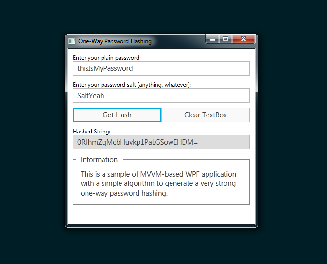

# SimpleOneWayHashing

**A simple Password Hashing Tool is a sample of MVVM implementation built in WPF.**

-----

This Visual C# project is one of learning examples for developing an application in WPF based on Model-View-ViewModel (MVVM) design pattern. MVVM is one of the best practices implemented in the most software development industries because this design pattern enables the separation between GUI and program logics. Thus, it makes easier for developers to collaborate each other across multiple departments or functional groups.

The code presented in this tool maybe a quite basic and I think it's good to take it as a start framework for the beginners. Even though this tool is purposely designed for a learning material for MVVM approach, but the program is a real use. This tool can generate an uncrackable hashed string for a plain password.

Here is the SHA1 algorithm I used in the application for computing the password hash:

```csharp
public string ComputeHash(string PlainText, string Salt)
{
    System.Text.UTF8Encoding utf8 = new System.Text.UTF8Encoding();
    byte[] textWithSaltBytes = utf8.GetBytes(string.Concat(PlainText, Salt));
    System.Security.Cryptography.HashAlgorithm hasher = new System.Security.Cryptography.SHA1CryptoServiceProvider();
    byte[] hashedBytes = hasher.ComputeHash(textWithSaltBytes);
    hasher.Clear();
    return Convert.ToBase64String(hashedBytes);
}
```

**Article:** [Developing WPF Application Using MVVM Design Pattern](http://heiswayi.github.io/developing-wpf-application-using-mvvm-design-pattern.html)

-----

### Screenshot



### License

```
This is free and unencumbered software released into the public domain.

Anyone is free to copy, modify, publish, use, compile, sell, or
distribute this software, either in source code form or as a compiled
binary, for any purpose, commercial or non-commercial, and by any
means.

In jurisdictions that recognize copyright laws, the author or authors
of this software dedicate any and all copyright interest in the
software to the public domain. We make this dedication for the benefit
of the public at large and to the detriment of our heirs and
successors. We intend this dedication to be an overt act of
relinquishment in perpetuity of all present and future rights to this
software under copyright law.

THE SOFTWARE IS PROVIDED "AS IS", WITHOUT WARRANTY OF ANY KIND,
EXPRESS OR IMPLIED, INCLUDING BUT NOT LIMITED TO THE WARRANTIES OF
MERCHANTABILITY, FITNESS FOR A PARTICULAR PURPOSE AND NONINFRINGEMENT.
IN NO EVENT SHALL THE AUTHORS BE LIABLE FOR ANY CLAIM, DAMAGES OR
OTHER LIABILITY, WHETHER IN AN ACTION OF CONTRACT, TORT OR OTHERWISE,
ARISING FROM, OUT OF OR IN CONNECTION WITH THE SOFTWARE OR THE USE OR
OTHER DEALINGS IN THE SOFTWARE.

For more information, please refer to <http://unlicense.org/>
```
